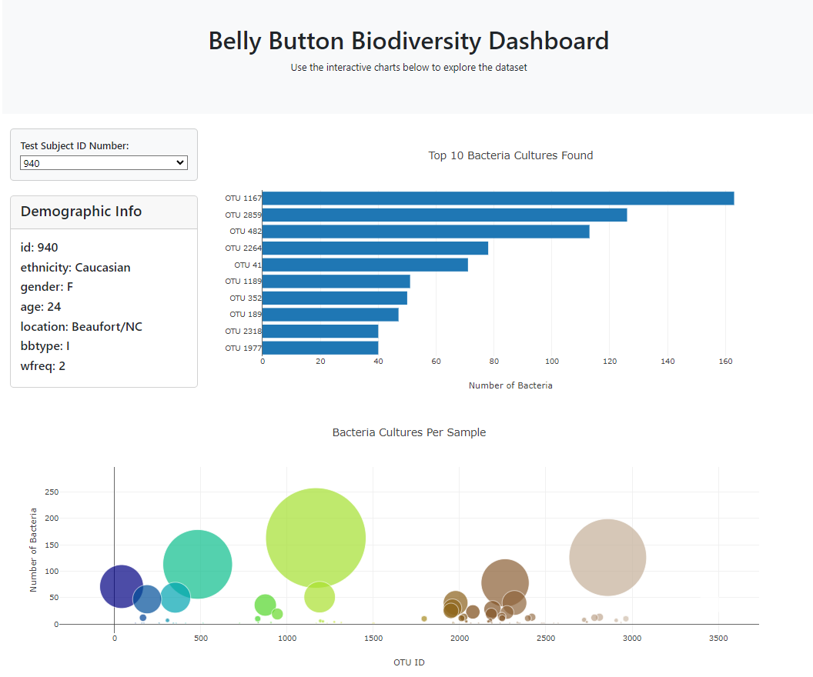
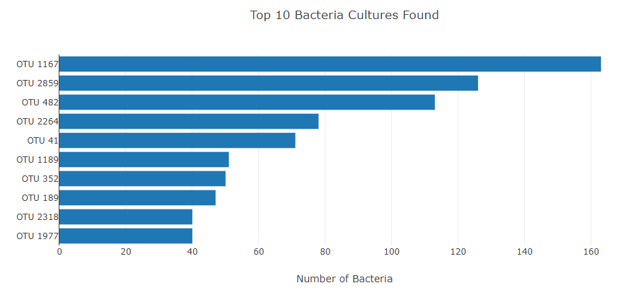
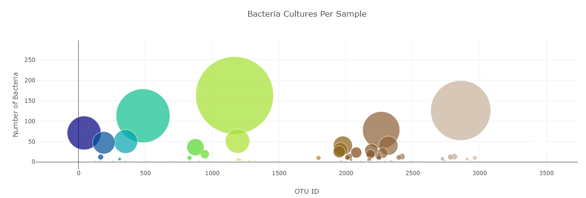

# BioD3: Belly Button Biodiversity

## Project Overview

This project creates an interactive dashboard of microbial data from various individuals, leveraging the D3.js library to parse and visualize information from a comprehensive JSON datasetm which catalogs the microbes that colonize human navels.

The dataset reveals that a small handful of microbial species (also called operational taxonomic units, or OTUs, in the study) were present in more than 70% of people, while the rest were relatively rare. Through an intuitive interface featuring dropdown menus and responsive charts, users can navigate through the dataset to uncover insights into the microbial communities within each sample. The visualization displays demographic metadata, enriching the context of each dataset explored. 

## Deployment
Interactive dashboard: [Belly Button Biodiversity Dashboard](https://jeremytallant.github.io/belly-button-challenge/).

  

## Steps:

1. Use the D3 library to read in `samples.json`.

2. Create a horizontal bar chart with a dropdown menu to display the top 10 OTUs found in that individual.

* Use `sample_values` as the values for the bar chart.

* Use `otu_ids` as the labels for the bar chart.

* Use `otu_labels` as the hovertext for the chart.

  

3. Create a bubble chart that displays each sample.

* Use `otu_ids` for the x values.

* Use `sample_values` for the y values.

* Use `sample_values` for the marker size.

* Use `otu_ids` for the marker colors.

* Use `otu_labels` for the text values.

4. Display the sample metadata, i.e., an individual's demographic information.

5. Display each key-value pair from the metadata JSON object somewhere on the page.

## How to Use
* Select a Test Subject ID No. from the dropdown menu to update the visualizations with data specific to that individual.
* Hover over the charts to see additional details about the bacteria cultures and their frequencies. 

## References
Hulcr, J. et al. (2012) A Jungle in There: Bacteria in Belly Buttons are Highly Diverse, but Predictable. Retrieved from: http://robdunnlab.com/projects/belly-button-biodiversity/results-and-data/Links to an external site.